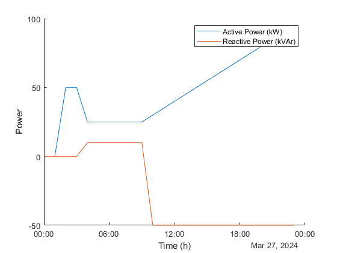

# IEEE 4 Bus with Generator Power Set by Smart Contract

## Installing Local Blockchain Dependencies

To deploy and test smart contract-based applications, we need an EVM (Ethereum Virtual Machine)-based simulator such as Ganache or Hardhat. Let's use Ganache due to its simplicity.
1. Install NVM (Node Version Manager) 
For Windows [Download and install](https://github.com/coreybutler/nvm-windows/releases) NVM setup executable.
For Linux, execute the code:

```shell
wget -qO- https://raw.githubusercontent.com/nvm-sh/nvm/v0.39.3/install.sh | bash
    source ~/.bashrc
```
2. Install Node JS and NPM
To verify the installation of NVM and install Node.js, you can execute the following commands in your terminal:

```shell
    nvm –version
    nvm ls
    nvm ls-remote
    nvm install v18.16.0
```
3. Install Ganache 

```shell
    npm install ganache --global
```

4. Install Truffle Suite

```shell
    npm install -g truffle
```
The <truffle-config.js> file configures the networks and Solidity compiler version for building and deploying smart contracts.

## Run Ganache and Deploy Smart Contracts
To run Ganache, execute the following commands in a separate terminal, specifying the port as 7545, gas limit as 0.5 Gwei, and network ID as 1515:

```shell
    ganache -p 7545 -l 500000000 -i 1515
```
To deploy the example smart contract (PowerGen.sol):
```shell
    truffle migrate --reset --network development
```
And that's it! Your smart contract is deployed and can be called.

## Interacting with smart contract from .m script
To interact with the smart contract deployed on the local Ganache blockchain, a Python-based interface is created in <contract_interface.py>. The interface is imported to .m script with lines:

```shell
    clear classes
    mod = py.importlib.import_module('contract_interface');
    py.importlib.reload(mod);
```

## Configure power system
The <IEEE4bus.m> file is used to configure the MATPOWER study case in the line:

```shell
    mpc = loadcase('IEEE4bus');
```   
Inside <IEEE4bus.m>, several matrices define the power system configuration:
* <mpc.bus> define the bus data.
* <mpc.gen> define the generator data.
* <mpc.branch> defines the branches with pi model.

## Submit transactions to edit Generator Power Flows
To update the active and reactive power of generators, the Python function <setGeneratorPower> is called as follows:
```shell
    py.contract_interface.setGeneratorPower(int32(0),int32(0));
```

The function <getGenerator> is used to read generator data from the smart contract, and then it is converted to the MATLAB data format with the following lines:

```shell
    Power = py.contract_interface.getGenerator();
    GenPower = double(py.array.array('d', py.numpy.nditer(Power)));
```

## Run MATPOWER to solve System Power Flow
The lines below turn off outputs in the command line _('verbose' = 0)_ and define MATPOWER constants (such as PG, QG, PD, QD, etc.) that refer to specific columns in the <mpc> matrices:

```shell
    mpopt = mpoption('verbose', 0, 'out.all', 0);
    define_constants;
```

The for loop runs the power flow analysis for a day in 1-hour steps. At the beginning of some iterations, the generator power is updated by calling <setGeneratorPower>. The first parameter represents the active power, and the second one represents the reactive power.

```shell
    for h=1:24
        if(h == 3)
            py.contract_interface.setGeneratorPower(int32(50),int32(0));
        end
        if(h == 5)
            py.contract_interface.setGeneratorPower(int32(25),int32(10));
        end
    
        if(h > 10)
            py.contract_interface.setGeneratorPower(int32(25+5*(h-10)),int32(-50));
        end
        Power = py.contract_interface.getGenerator();
        GenPower = double(py.array.array('d', py.numpy.nditer(Power)));
	    mpc.gen(1, PG) = GenPower(1);
        mpc.gen(1, QG) = GenPower(2);
        results{h} = runpf(mpc, mpopt);
	    gen_power_kW(:,h) = results{h}.gen(:,PG);
	    gen_power_kVAr(:,h) = results{h}.gen(:,QG);
	    buses_voltage(:,h) = results{h}.bus(:,VM);
        Grid(:,h) = sum(results{h}.branch(1:2, PF));
    end
```

Finally, the results are plotted: 

```shell
    initial_time = datetime('today', 'Format', 'yyyy-MM-dd HH:mm:ss');
    simulation_time = initial_time + hours(0:23);
    figure(1)
    hold on 
    plot(simulation_time,gen_power_kW(1,:))
    plot(simulation_time,gen_power_kVAr(1,:))
    legend('Active Power (kW)', 'Reactive Power (kVAr)')
    xlabel('Time (h)')
    ylabel('Power')
```

