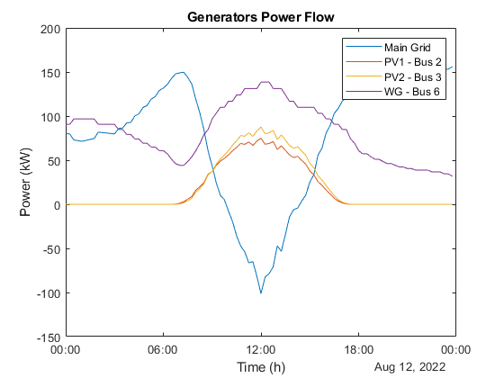
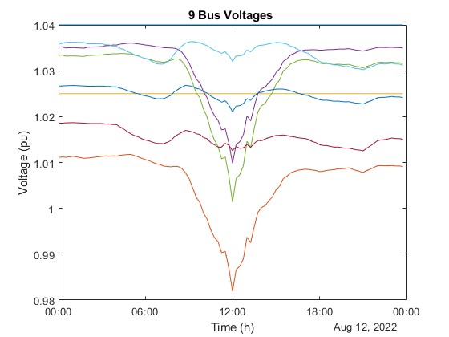

# IEEE 9 Bus with Distributed Generation and Post-Delivery Descentrilized Energy Market

## Installing Local Blockchain Dependencies

To deploy and test smart contract-based applications, we need an EVM (Ethereum Virtual Machine)-based simulator such as Ganache or Hardhat. Let's use Ganache due to its simplicity.
1. Install NVM (Node Version Manager) 
For Windows [Download and install](https://github.com/coreybutler/nvm-windows/releases) NVM setup executable.
For Linux, execute the code:

```shell
wget -qO- https://raw.githubusercontent.com/nvm-sh/nvm/v0.39.3/install.sh | bash
    source ~/.bashrc
```
2. Install Node JS and NPM
To verify the installation of NVM and install Node.js, you can execute the following commands in your terminal:

```shell
    nvm –version
    nvm ls
    nvm ls-remote
    nvm install v18.16.0
```
3. Install Ganache 

```shell
    npm install ganache --global
```

4. Install Truffle Suite

```shell
    npm install -g truffle
```
The <truffle-config.js> file configures the networks and Solidity compiler version for building and deploying smart contracts.

## Run Ganache and Deploy Smart Contracts
To run Ganache, execute the following commands in a separate terminal, specifying the port as 7545, gas limit as 0.5 Gwei, and network ID as 1515:

```shell
    ganache -p 7545 -l 500000000 -i 1515
```
To deploy the example smart contract (PowerGen.sol):
```shell
    truffle migrate --reset --network development
```
And that's it! Your smart contract is deployed and can be called.

## Installing IPFS local node
The Interplanetary File System (IPFS) is a protocol and network designed to create a peer-to-peer associative storage that is content-addressable for storing and sharing hypermedia in a distributed file system.
Install IPFS following the [Get Started](https://docs.ipfs.tech/install/) description for you system. For Windows, install [IPFS Desktop App](https://docs.ipfs.tech/install/ipfs-desktop/#windows).


## Interacting with smart contract from .m script
To interact with the smart contract deployed on the local Ganache blockchain, a Python-based interface is created in <degen9bus.py>. The interface is imported to .m script with lines:

```shell
    clear classes
    mod = py.importlib.import_module('degen9bus');
    py.importlib.reload(mod);
```

## Configure power system
Metereological and load data is imported with mat files and filtered by date to compose system loads and power generators (PV and Wind). Functions are used to calculate PV and Wind Generation from solar and wind speed data. 
The <case9.m> file is used to configure the MATPOWER study case in the line:

```shell
    mpc = loadcase('case9');
```   
Inside <case9.m>, several matrices define the power system configuration:
* <mpc.bus> define the bus data.
* <mpc.gen> define the generator data.
* <mpc.branch> defines the branches with pi model.
Generators are allocated at Bus 2, 3 and 6 respectively. Main Grid is connect at Bus 1. Loads are connected at Buses 5, 7 and 9.

## Submit Energy Bids to a Post-delivery Market
After Power Flow Optimization the power flow results are passed to DLEMcontract function who calls python function to interact with IPFS and the smart contract deployed at Blockchain:

```shell
    DLEMcontract(data(:,{'Gen-01','Gen-02','Gen-03'}), filteredLoad.UC1, filteredLoad.UC2, filteredLoad.UC9)
```


